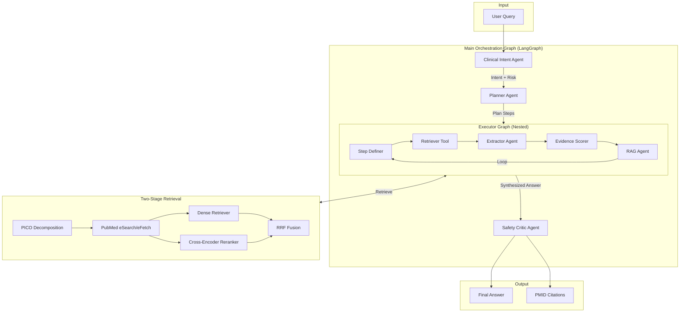

# Medical RAG Chatbot (MA-RAG)

**A Multi-Agent Retrieval-Augmented Generation System for Evidence-Based Medical Information Retrieval**

[](https://www.python.org/downloads/)
[](https://opensource.org/licenses/MIT)
[](https://github.com/langchain-ai/langgraph)

> **M.Tech Thesis Project** — Building a clinical-grade medical question-answering system with real-time PubMed retrieval, multi-agent reasoning, and safety-first design.

---

## Table of Contents

1. [Project Overview](#1-project-overview)
2. [System Architecture](#2-system-architecture)
3. [Folder Structure](#3-folder-structure)
4. [Agent Design](#4-agent-design)
5. [Retrieval Pipeline](#5-retrieval-pipeline)
6. [Safety & Clinical Guardrails](#6-safety--clinical-guardrails)
7. [Technology Stack](#7-technology-stack)
8. [How to Run Locally](#8-how-to-run-locally)
9. [Current Limitations](#9-current-limitations)
10. [Future Work](#10-future-work-thesis-roadmap)
11. [Interview Talking Points](#11-interview-talking-points)

---

## 1. Project Overview

### Problem Statement

Large Language Models (LLMs) can generate fluent medical responses but suffer from:
- **Hallucination** — fabricating medical facts without evidence
- **Knowledge cutoff** — inability to access recent literature
- **Lack of traceability** — no citations to verify claims
- **Safety gaps** — giving direct medical advice without appropriate caveats

### Solution

This system implements a **Multi-Agent Retrieval-Augmented Generation (MA-RAG)** architecture that:

1. **Retrieves real-time evidence** from PubMed's 35M+ articles
2. **Decomposes complex queries** into structured sub-tasks via planning
3. **Grades evidence quality** using study type classification (RCT vs. case report)
4. **Enforces clinical safety** through intent classification and risk assessment
5. **Provides traceable citations** with clickable PMID links

### Target Users

- **Medical professionals** seeking evidence-based literature summaries
- **Researchers** needing rapid systematic review of topics
- **Medical students** learning with referenced explanations
- **Healthcare organizations** building clinical decision support tools

### Why Multi-Agent RAG?

| Single LLM Approach | Multi-Agent RAG (This System) |
|---------------------|-------------------------------|
| One-shot generation | Iterative plan → execute → synthesize |
| Static knowledge | Real-time PubMed retrieval |
| No evidence grading | A/B/C evidence classification |
| Generic safety | Clinical intent + risk-level routing |
| Hidden reasoning | Transparent Chain of Thought |

---

## 2. System Architecture

### High-Level Pipeline

```
User Query
    │
    ▼
┌─────────────────────────────────────────────────────────────────┐
│                    MAIN ORCHESTRATION GRAPH                      │
│  ┌──────────────┐   ┌─────────────┐   ┌───────────────────────┐ │
│  │   Clinical   │──▶│   Planner   │──▶│   Executor (Nested)   │ │
│  │Intent Agent  │   │   Agent     │   │       Graph           │ │
│  └──────────────┘   └─────────────┘   └───────────────────────┘ │
│         │                 │                      │               │
│         ▼                 ▼                      ▼               │
│  ┌──────────────┐   ┌─────────────┐   ┌───────────────────────┐ │
│  │ Risk Level   │   │ Multi-Step  │   │ For each step:        │ │
│  │ Intent Type  │   │    Plan     │   │  • StepDefiner        │ │
│  │ Disclaimer?  │   │             │   │  • Retriever → PICO   │ │
│  └──────────────┘   └─────────────┘   │  • Extractor          │ │
│                                        │  • RAG Agent          │ │
│                                        │  • EvidenceScorer     │ │
│                                        └───────────────────────┘ │
│                                                   │               │
│                                                   ▼               │
│                                        ┌───────────────────────┐ │
│                                        │    Safety Critic      │ │
│                                        │    Agent              │ │
│                                        └───────────────────────┘ │
│                                                   │               │
└───────────────────────────────────────────────────┼───────────────┘
                                                    ▼
                                           Final Answer + Citations
```

### Architecture Diagram (Mermaid)



### Control Flow

1. **Clinical Intent Classification** → Determine query risk level (low/medium/high) and intent type (informational/diagnostic/therapeutic/mechanism)
2. **Planning** → Decompose complex queries into atomic sub-questions
3. **Iterative Execution** → For each step: retrieve → extract → score → answer
4. **Summarization** → Aggregate all step outputs with PMID citations
5. **Safety Audit** → Verify answer safety, add disclaimers if needed

---

## 3. Folder Structure

```
RAG_CHAT_BOT_MRAGE/
│
├── app.py                          # Streamlit chat interface
├── requirements.txt                # Python dependencies
├── .env.example                    # Environment variable template
│
├── src/                            # Core source code
│   ├── agent.py                    # MedicalAgent high-level interface
│   ├── config.py                   # Pydantic settings management
│   ├── exceptions.py               # Custom exception classes
│   ├── pubmed_client.py            # PubMed E-utilities client (eSearch/eFetch)
│   ├── query_builder.py            # PICO-based query construction
│   │
│   ├── agents/                     # Specialized agents
│   │   ├── clinical_intent.py      # Risk/intent classification
│   │   ├── planner.py              # Query decomposition
│   │   ├── executor.py             # Nested execution graph
│   │   ├── step_definer.py         # Task routing logic
│   │   ├── extractor.py            # Document fact extraction
│   │   ├── evidence_scorer.py      # Evidence quality grading
│   │   ├── rag.py                  # Context-aware QA
│   │   └── safety_critic.py        # Answer safety audit
│   │
│   ├── orchestrator/               # Graph orchestration
│   │   └── graph.py                # LangGraph main pipeline
│   │
│   ├── tools/                      # Retrieval components
│   │   ├── retriever.py            # Two-stage retrieval + reranking
│   │   ├── dense_retriever.py      # Embedding-based retrieval
│   │   └── chunker.py              # Text chunking utilities
│   │
│   ├── prompts/                    # LLM prompt templates
│   │   └── templates.py            # All agent prompts
│   │
│   ├── state/                      # State management
│   │   └── state.py                # TypedDict state definitions
│   │
│   ├── core/                       # Core utilities
│   │   └── registry.py             # Model registry (Gemini/Ollama)
│   │
│   └── evaluation/                 # Benchmarking
│       ├── evaluator.py            # PubMedQA evaluator
│       ├── pubmedqa_dataset.py     # Dataset loader
│       └── adapter.py              # Answer extraction
│
├── tests/                          # Unit tests
│   ├── test_pubmed_client.py
│   ├── test_query_builder.py
│   ├── test_evaluator.py
│   └── test_pubmedqa_dataset.py
│
├── data/                           # Benchmark data
│   └── benchmark.json              # PubMedQA dataset
│
├── results/                        # Evaluation results
│
└── colab/                          # Google Colab notebooks
```

### Core vs. Utility Code

| Category | Files | Purpose |
|----------|-------|---------|
| **Core Logic** | `agents/*.py`, `orchestrator/graph.py`, `tools/retriever.py` | Multi-agent orchestration, retrieval pipeline |
| **Infrastructure** | `config.py`, `registry.py`, `pubmed_client.py` | Configuration, model management, API clients |
| **Interface** | `app.py`, `agent.py` | User-facing chat interface |
| **Evaluation** | `evaluation/*.py` | PubMedQA benchmarking |
| **Utilities** | `chunker.py`, `query_builder.py`, `exceptions.py` | Text processing, query construction |

---

## 4. Agent Design

### Agent Overview

| Agent | Purpose | Model Tier | Async |
|-------|---------|------------|-------|
| `ClinicalIntentAgent` | Classify intent and risk | Flash (Fast) | ✓ |
| `PlannerAgent` | Decompose query into steps | Heavy (Smart) | ✓ |
| `StepDefinerAgent` | Route to aggregate vs. QA | Light (Fast) | ✓ |
| `ExtractorAgent` | Extract facts with chunking | Heavy (Smart) | ✓ |
| `EvidenceScorerAgent` | Grade evidence A/B/C | Flash (Fast) | ✓ |
| `RagAgent` | Generate contextual answers | Heavy (Smart) | ✓ |
| `ClinicalSafetyCriticAgent` | Audit safety compliance | Heavy (Smart) | ✓ |

---

### 4.1 Clinical Intent Agent

**Purpose:** First-gate classification to determine query risk profile and routing.

**Input:**
```python
{
    "original_question": str  # User query
}
```

**Output:**
```python
{
    "intent": "informational" | "diagnostic" | "therapeutic" | "mechanism",
    "risk_level": "low" | "medium" | "high",
    "requires_disclaimer": bool,
    "needs_guidelines": bool
}
```

**Decision Logic:**
- `therapeutic/diagnostic` → High risk → Disclaimer mandatory
- Keywords like "management", "treatment protocols" → `needs_guidelines=True` → Prioritize practice guidelines in retrieval
- `informational` (definitions, anatomy) → Low risk → Fast-path routing

---

### 4.2 Planner Agent

**Purpose:** Decompose complex queries into atomic sub-questions.

**Input:**
```python
{
    "original_question": str,
    "past_exp": List[Dict]  # Previous execution history for learning
}
```

**Output:**
```python
{
    "plan": ["Step 1 question", "Step 2 question", ...]
}
```

**Decision Logic:**
- Simple queries (definitions) → Single-step plan
- Complex queries → Multi-step decomposition
- Uses `past_exp` memory to avoid repeating failed strategies

**Example:**
```
Query: "Compare the efficacy of Drug A vs Drug B for hypertension"
Plan:
  1. "What is the efficacy of Drug A for hypertension?"
  2. "What is the efficacy of Drug B for hypertension?"
  3. "Compare the efficacy results of Drug A and Drug B"
```

---

### 4.3 Executor (Nested Graph)

**Purpose:** Execute each plan step through a retrieve-extract-answer loop.

**Architecture:** LangGraph nested graph with:
- `task_definer_node` → `execution_node` → `task_definer_node` (loop until stop)

**Per-Step Flow:**
1. `StepDefiner` classifies step as `question-answering` or `aggregate`
2. For QA: Retriever → Extractor → RAG Agent
3. For Aggregate: Direct LLM synthesis
4. Store output, loop to next step

**Fast-Path Optimization:**
For simple `informational` queries with single-step plans:
- Skip Extractor Agent
- Directly truncate retrieved contexts
- Reduces latency by ~30%

---

### 4.4 Extractor Agent

**Purpose:** Filter retrieved documents into concise, relevant facts.

**Input:**
```python
{
    "question": str,
    "documents": List[str]  # Retrieved abstracts
}
```

**Output:**
```python
{
    "notes": str,           # Formatted bullet points with evidence grades
    "confidence": "HIGH" | "MEDIUM" | "LOW" | "NONE",
    "facts": List[str],     # Deduplicated facts
    "scored_facts": List[Dict]  # Facts with A/B/C grades
}
```

**Processing Pipeline:**
1. **Chunking** → Split abstracts into 4-sentence chunks with 1-sentence overlap
2. **Batch Extraction** → Process 2 chunks per LLM call
3. **Deduplication** → Remove duplicate facts
4. **Evidence Scoring** → Grade each fact A/B/C via `EvidenceScorerAgent`

---

### 4.5 Evidence Scorer Agent

**Purpose:** Assign evidence quality grades based on study type.

**Grading Criteria:**
| Grade | Study Types | Confidence |
|-------|-------------|------------|
| **A** (High) | Systematic Reviews, Meta-analyses, Large RCTs, Guidelines | 0.9+ |
| **B** (Moderate) | Small RCTs, Cohort studies, Case-control | 0.6-0.9 |
| **C** (Low) | Case reports, Expert opinion, Animal studies, In-vitro | <0.6 |

**Keywords Detected:**
- Grade A: "randomized", "double-blind", "meta-analysis", "guideline"
- Grade C: "in mice", "in vitro", "case report"

---

### 4.6 Safety Critic Agent

**Purpose:** Audit final answer for clinical safety compliance.

**Checklist:**
1. **Absolutes** — Does it use "always", "never", "cure" inappropriately?
2. **Uncertainty** — Does it convey appropriate medical uncertainty?
3. **Disclaimer** — Is disclaimer present for high/medium risk queries?
4. **Hallucination** — Do claims have supporting citations?
5. **Contraindications** — Are drug risks mentioned?
6. **Citation Preservation** — Are PMIDs retained in output?

**Output:**
```python
{
    "is_safe": bool,
    "issues": List[str],       # Safety violations found
    "refined_answer": str | None  # Corrected answer if needed
}
```

---

## 5. Retrieval Pipeline

### Query Processing Flow

```
User Query
    │
    ▼
┌─────────────────────────────────────┐
│      PICO Decomposition (LLM)       │
│  Population / Intervention /        │
│  Comparison / Outcome / Modifiers   │
└─────────────────────────────────────┘
    │
    ▼
┌─────────────────────────────────────┐
│      PubMed Query Builder           │
│  • MeSH term injection              │
│  • Boolean assembly (OR within,     │
│    AND between concepts)            │
│  • [tiab] field tags                │
│  • Humans[MeSH] filter              │
└─────────────────────────────────────┘
    │
    ▼
┌─────────────────────────────────────┐
│      Stage 1: PubMed Retrieval      │
│  eSearch → PMIDs (75 max)           │
│  eFetch → XML → Parse               │
│  Filter: humans, recent 7 years     │
│  Validate: Pydantic schema          │
└─────────────────────────────────────┘
    │
    ▼
┌─────────────────────────────────────┐
│      Stage 2: Hybrid Ranking        │
│  BM25 ranking (original order)      │
│  Dense embedding (MiniLM-L6-v2)     │
│  RRF Fusion (k=60)                  │
│  Cross-Encoder Reranking (top-k)    │
└─────────────────────────────────────┘
    │
    ▼
Top 8-20 Documents (Dynamic-K)
```

### PICO Extraction

The system uses LLM-based PICO decomposition:

```python
PICOQuery:
  population: ["Hirschsprung's Disease", "congenital megacolon"]  # Synonyms
  intervention: ["management", "treatment", "therapy"]
  comparison: []
  outcome: []
  modifiers: ["newborn", "infant", "acute"]
```

### Query Builder Features

- **MeSH Injection:** Maps "melanoma" → `Melanoma[MeSH]`
- **Topic Normalization:** Maps "treatment" → `["treatment", "therapy", "management", "Therapeutics[MeSH]"]`
- **Roman/Arabic Variants:** "Stage II" ↔ "Stage 2"
- **Study Type Filters:** Practice Guidelines, RCTs, Meta-analyses

### Hybrid Retrieval (BM25 + Dense)

1. **BM25 Ranking:** PubMed's default relevance order
2. **Dense Ranking:** Sentence-transformer embeddings (`all-MiniLM-L6-v2`)
3. **RRF Fusion:** `score = Σ 1/(k + rank)` with k=60
4. **Cross-Encoder Reranking:** `ms-marco-MiniLM-L-6-v2` for final scoring

### Dynamic Top-K

Query complexity analysis adjusts retrieval depth:
- **Specific** (mutations, pathways): k=8
- **Moderate** (standard queries): k=12
- **Broad** (overview, trends): k=20

### Citation Tracking

- PMIDs tracked per step via `step_docs_ids`
- Aggregated in summary with inline citations: `(PMID:12345678)`
- Clickable links generated in UI: `[PMID:12345678](https://pubmed.ncbi.nlm.nih.gov/12345678/)`

---

## 6. Safety & Clinical Guardrails

### Clinical Intent Classification

| Intent | Risk Level | Disclaimer | Example |
|--------|------------|------------|---------|
| `informational` | Low | No | "What is hypertension?" |
| `mechanism` | Low-Medium | No | "How do ACE inhibitors work?" |
| `therapeutic` | High | **Yes** | "What dosage of metformin for diabetes?" |
| `diagnostic` | High | **Yes** | "Is this rash indicative of lupus?" |

### Risk Handling Strategy

```python
if risk_level == "high":
    # Mandatory actions:
    requires_disclaimer = True
    needs_guidelines = True  # Prioritize practice guidelines
    
    # Safety Critic performs stricter audit:
    # - Check for absolute claims
    # - Verify contraindication mentions
    # - Ensure appropriate uncertainty language
```

### Disclaimer Generation

Automatically appended for high/medium risk:
```
⚠️ **Medical Disclaimer:** This information is for educational purposes only. 
Always consult a qualified healthcare provider for medical advice, diagnosis, or treatment.
```

### Safeguards & Limitations

1. **No Direct Diagnosis** — System provides evidence summaries, not diagnoses
2. **Citation Requirement** — All factual claims backed by PMIDs
3. **Uncertainty Expression** — Uses hedging language ("studies suggest", "evidence indicates")
4. **Contraindication Awareness** — Drug mentions include risk/side effect notes when available
5. **Fallback Safety** — On classification errors, defaults to `requires_disclaimer=True`

---

## 7. Technology Stack

### Core Language
- **Python 3.10+** — Primary implementation language

### LLM Integration
| Component | Provider | Model |
|-----------|----------|-------|
| Heavy Tasks (Planning, QA, Extraction) | Ollama / Gemini | `llama3.2:3b` / `gemini-2.0-flash` |
| Fast Tasks (Intent, Scoring, Steps) | Ollama | `qwen2.5:1.5b` |
| Hybrid Mode | Gemini + Ollama | Heavy=Gemini, Light=Ollama |

### Retrieval Components
| Component | Technology |
|-----------|------------|
| Sparse Retrieval | PubMed eSearch (BM25-like) |
| Dense Retrieval | `all-MiniLM-L6-v2` / `S-PubMedBert-MS-MARCO` |
| Biomedical Retrieval (Optional) | MedCPT (Query + Article Encoders) |
| Cross-Encoder Reranking | `ms-marco-MiniLM-L-6-v2` |
| Text Chunking | Custom sentence/section splitter |

### Orchestration
- **LangGraph** — State machine-based multi-agent orchestration
- **LangChain** — Prompt templates, output parsing
- **Pydantic** — Input/output validation, settings management

### Infrastructure
- **aiohttp** — Async HTTP for PubMed API
- **tenacity** — Retry with exponential backoff
- **BeautifulSoup + lxml** — XML parsing for eFetch responses
- **nest_asyncio** — Event loop compatibility for Streamlit

### UI Layer
- **Streamlit** — Chat-based web interface
- Custom CSS with dark theme, risk badges, thinking visualization

### Evaluation
- **PubMedQA** — Benchmark dataset (yes/no/maybe classification)
- Custom evaluator with answer extraction via regex patterns

---

## 8. How to Run Locally

### Prerequisites

- Python 3.10+
- [Ollama](https://ollama.ai/) (for local LLMs) **OR** Google API key (for Gemini)
- ~4GB RAM minimum (8GB+ recommended)

### Step 1: Clone Repository

```bash
git clone https://github.com/yourusername/RAG_CHAT_BOT_MRAGE.git
cd RAG_CHAT_BOT_MRAGE
```

### Step 2: Create Virtual Environment

```bash
python -m venv env
.\env\Scripts\activate  # Windows
# source env/bin/activate  # Linux/Mac
```

### Step 3: Install Dependencies

```bash
pip install -r requirements.txt
```

### Step 4: Configure Environment

Copy `.env.example` to `.env` and configure:

```ini
# For Ollama (default)
USE_OLLAMA=True
OLLAMA_BASE_URL=http://localhost:11434
OLLAMA_SMART_MODEL=llama3.2:3b
OLLAMA_FAST_MODEL=qwen2.5:1.5b

# OR for Gemini
USE_OLLAMA=False
GOOGLE_API_KEY=your_google_api_key

# Optional: PubMed API key for higher rate limits
PUBMED_API_KEY=your_ncbi_key
```

### Step 5: Pull Ollama Models (if using Ollama)

```bash
ollama pull llama3.2:3b
ollama pull qwen2.5:1.5b
```

### Step 6: Run Application

```bash
streamlit run app.py
```

Access at `http://localhost:8501`

### Running Evaluation

```bash
python run_evaluation.py --limit 50
```

---

## 9. Current Limitations

### Technical Limitations

- **Latency:** Complex queries take 30-60+ seconds due to multi-agent orchestration
- **Context Window:** Limited to ~500 chars per abstract chunk (model constraints)
- **Single Query:** No multi-turn conversation memory beyond current session
- **English Only:** PubMed queries and LLM prompts optimized for English

### Data Limitations

- **PubMed Coverage:** Excludes non-indexed journals, preprints, non-medical sources
- **Recency Lag:** PubMed indexing can lag 2-4 weeks behind publication
- **Abstract-Only:** Full-text retrieval not implemented (abstract-only analysis)
- **No Image Analysis:** Cannot process figures, tables, or medical imaging

### Performance Constraints

- **No GPU Required:** Runs on CPU with Ollama, but slower
- **Rate Limits:** PubMed API limits without API key (3 req/sec)
- **Model Size Tradeoff:** Smaller models (1.5B-3B) vs. accuracy

---

## 10. Future Work (Thesis Roadmap)

### Planned Improvements

| Feature | Status | Target |
|---------|--------|--------|
| Conversation memory (multi-turn) | Planned | Feb 2025 |
| Full-text retrieval via PMC | Planned | Feb 2025 |
| Knowledge graph integration | Research | Mar 2025 |
| Multilingual support | Planned | Mar 2025 |
| Drug interaction checking | Design | Apr 2025 |
| Clinical trial matching | Research | Apr 2025 |

### Evaluation Strategy

- **PubMedQA:** Yes/No/Maybe classification accuracy
- **MIRAGE Benchmark:** Multi-hop medical reasoning
- **Human Evaluation:** Clinician assessment of answer quality
- **Latency Metrics:** P50/P95 response times

### Scalability Plans

- Containerization with Docker
- Redis caching for frequent queries
- Parallel agent execution
- GPU-accelerated MedCPT retrieval

### Research Extensions

- Retrieval-Interleaved Generation (RIG) patterns
- Self-RAG with adaptive retrieval
- Multi-modal extension (radiology images)
- Federated learning for institution-specific tuning

---

## 11. Interview Talking Points

### Design Trade-offs

1. **Multi-Agent vs. Single-Prompt RAG**
   - *Choice:* Multi-agent with specialized roles
   - *Reason:* Better separation of concerns, easier debugging, modular improvements
   - *Trade-off:* Higher latency from multiple LLM calls

2. **LangGraph vs. Custom Orchestration**
   - *Choice:* LangGraph
   - *Reason:* Built-in state management, conditional edges, checkpoint support
   - *Trade-off:* Learning curve, framework dependency

3. **Hybrid Retrieval (BM25 + Dense)**
   - *Choice:* RRF fusion of BM25 + dense rankings
   - *Reason:* BM25 excels at keyword matching, dense captures semantics
   - *Trade-off:* Additional latency from embedding computation

4. **Cross-Encoder Reranking**
   - *Choice:* Two-stage (fast retrieve → slow rerank)
   - *Reason:* Cross-encoders are too slow for initial retrieval but improve precision
   - *Trade-off:* Extra 200-500ms per query

5. **PICO-based Query Decomposition**
   - *Choice:* LLM-based PICO extraction
   - *Reason:* Aligns with EBM (Evidence-Based Medicine) methodology
   - *Trade-off:* Not all queries map cleanly to PICO

### Why Specific Tools Were Chosen

- **Pydantic:** Strong typing, automatic validation, settings management
- **LangGraph over autogen/CrewAI:** Better state management, async support
- **Ollama over Hugging Face local:** Simpler setup, optimized inference
- **Sentence-Transformers:** Battle-tested, good quality/speed balance
- **Streamlit over Gradio:** Better chat UX, native session state

### What I Would Improve With More Time

1. **Caching Layer:** Redis/Memcached for repeated query patterns
2. **Streaming Responses:** Token-by-token output for better UX
3. **Retrieval Quality Feedback Loop:** Learn from user clicks on citations
4. **Comprehensive Evaluation Suite:** Beyond PubMedQA to clinical scenarios
5. **Production Infrastructure:** Kubernetes, monitoring, A/B testing
6. **Fine-tuned Medical LLM:** Domain-specific small model for extraction

---

## License

MIT License — see [LICENSE](LICENSE) for details.

## Author

**Soumen Mishra**  
M.Tech Student — AI/ML Specialization  
Thesis: *Multi-Agent Retrieval-Augmented Generation for Clinical Decision Support*

---

*Built with ❤️ for evidence-based medicine*
