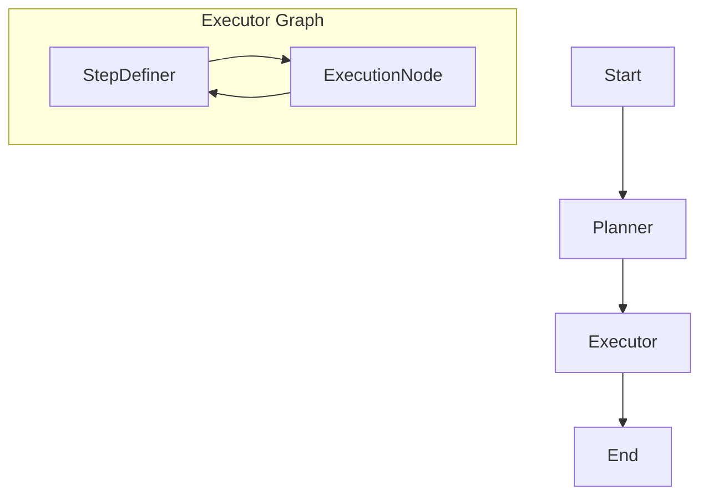

# MA-RAG Pipeline Implementation Walkthrough

We have successfully implemented the Model-Augmented RAG (MA-RAG) pipeline, adapted for the Medical domain.

## Architecture

The pipeline uses **LangGraph** to orchestrate an iterative planning and execution workflow.



### Components

1.  **Planner Agent** (`src/agents/planner.py`):
    -   Breaks down the user query into logical steps.
    -   Uses previous execution history (`past_exp`) to improve plans.
    
2.  **Executor Graph** (`src/agents/executor.py`):
    -   **StepDefiner**: Dynamic decision maker. deciding the next specific task or stopping if the plan is complete.
    -   **ExecutionNode**: Executes the defined task.
        -   **Aggregation**: Synthesizes information.
        -   **RAG**: Retrieves documents using `RetrieverTool` (`PubMedClient`).

3.  **Infrastructure**:
    -   **State**: `src/state/state.py` defines strict TypedDicts and Pydantic models.
    -   **Registry**: `src/core/registry.py` provides LLM instances (Ollama/Gemini).
    -   **Prompts**: `src/prompts/templates.py` centralized prompt management.

## Key Features

-   **Ollama Compatibility**: Refactored to use `PydanticOutputParser` and explicit JSON instructions to generic models like Llama 3.
-   **Robustness**: Fallbacks for parsing errors and retrieval failures.
-   **Clean Architecture**: Separation of concerns between Agents, Tools, and State.

## How to Run

Use the CLI script to verify the pipeline:

```bash
python run_pipeline.py
```

Ensure you have Ollama running with the configured model:
```bash
ollama serve
ollama pull llama3.2:3b
```

## Configuration

Settings are managed in `src/config.py`.

```python
# Switch backend
USE_OLLAMA=True
OLLAMA_MODEL="llama3.2:3b"
```
